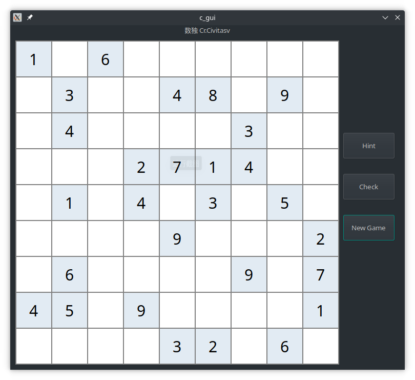

# Implement sudoku in C using GTK3

Initially, I thought it will be so hard and tedious using C to implement GUI program. However, it's really interesting and easy, and I can concentrate on the program rather language syntax. And it's really exicting to control everything, with Java I can't do it.

## Show it

